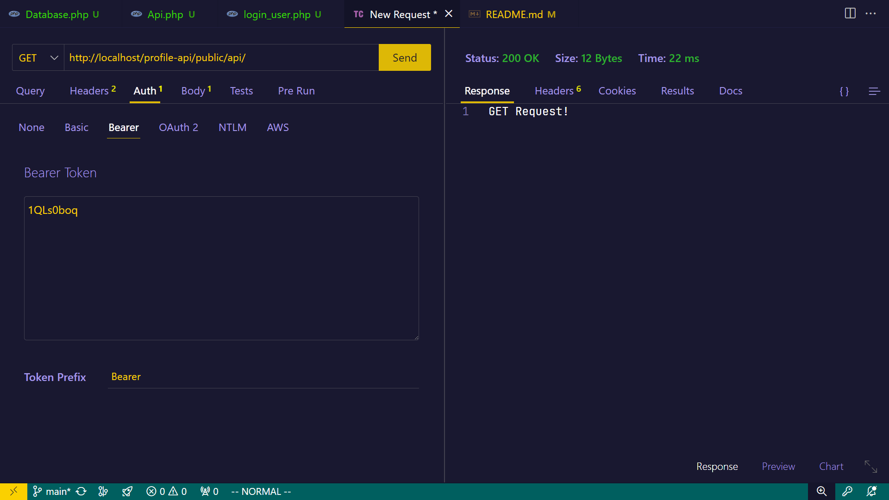
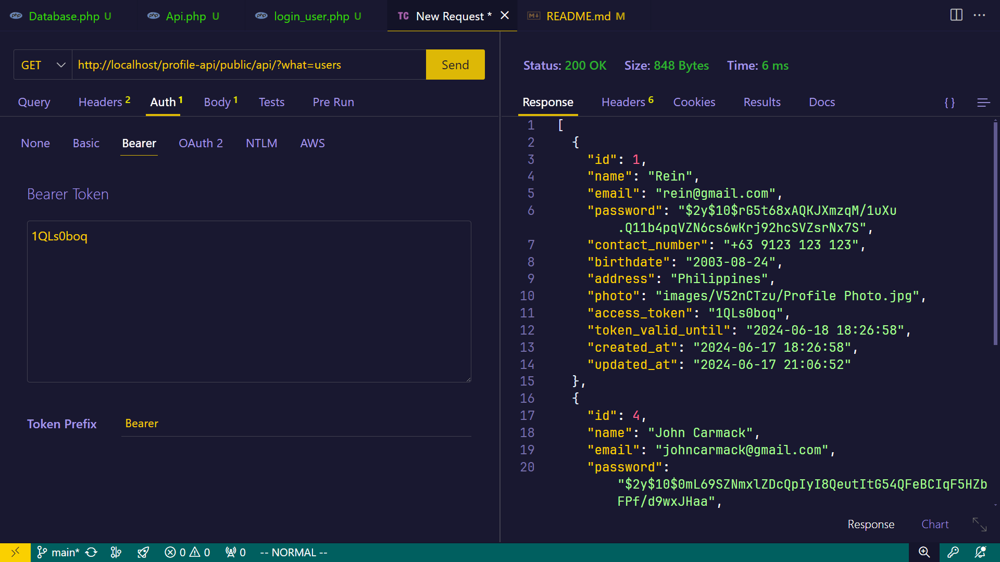
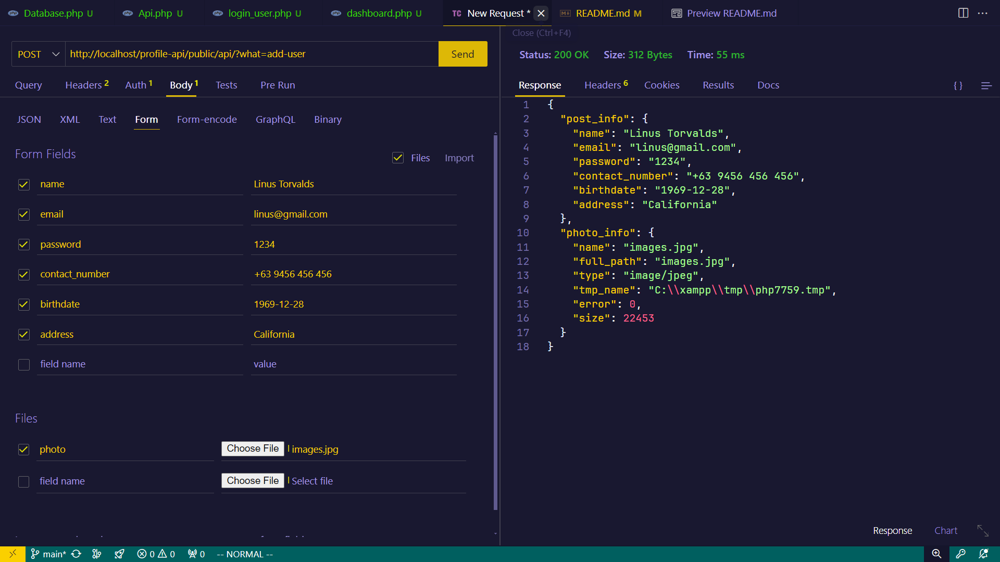
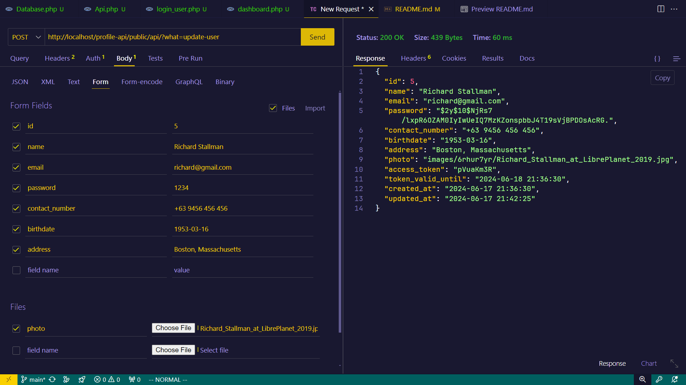
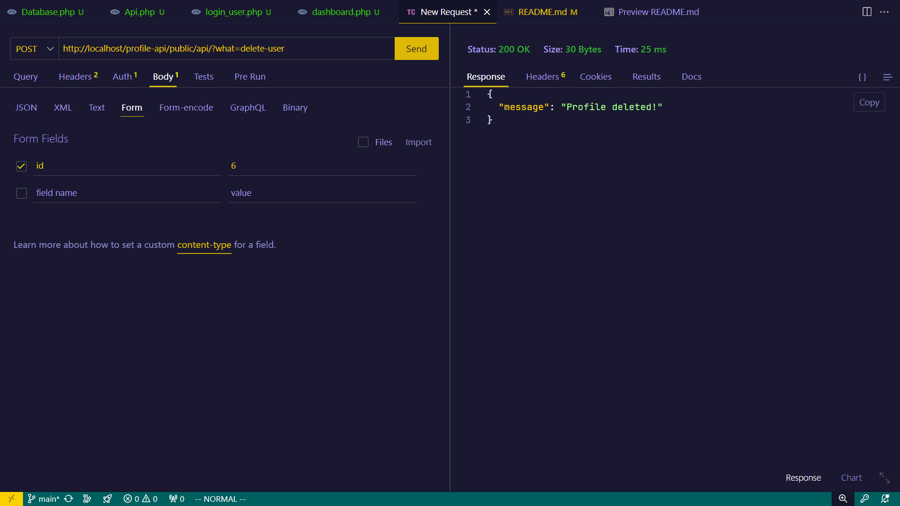

# profile-api
Final project for Integrative Programming, an application where you can send API requests with Bearer tokens to modify database contents.

## Application setup
The "profile-api" directory should be inside the xampp/htdocs directory for so that the request endpoints could work.

## Get request endpoints

#### Default GET request
http://localhost/profile-api/public/api/

#### Get all the users in the database
http://localhost/profile-api/public/api/?what=users

## Post request endpoints

#### Add a user to our database
http://localhost/profile-api/public/api/?what=add-user

#### Edit a user to our database
http://localhost/profile-api/public/api/?what=edit-user

#### Delete a user to our database
http://localhost/profile-api/public/api/?what=delete-user
