# profile-api
Final project for Integrative Programming, an application where you can send 
API requests with Bearer tokens to modify database contents.

## Application setup
The "profile-api" directory should be inside the xampp/htdocs directory for so
that the request endpoints could work. If the repository is downloaded via ZIP
file, "profile-api" will be renamed to "profile-api-main", rename the directory 
as you please or modify the GET and POST request endpoints from "profile-api" 
to "profile-api-main". For the rest of the README file, we will be assuming 
that the application is named as "profile-api".

Before starting the application, make sure that the database for the profile 
API is imported, this is stored as api_db.sql in the repository. To easily 
import the database, go to the XAMPP control panel, click on the Admin button
for MySQL, this will make the phpmyadmin panel appear where we will be able to
see all our current databases.

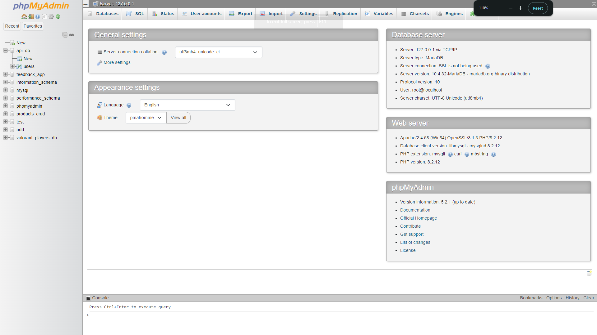

Before importing our database, we must first create a database, click on the 
"new" at the left panel to create a database, after this we will be prompted to
create a database. Name this database "api_db" and click create.

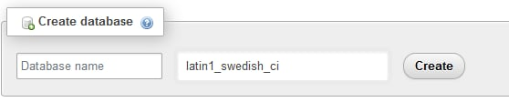

After creating the database, import the SQl file that is stored within this
repository. To do this, click on the api_db database, find the import tab, find
the SQL file in this repository, and import said file. This will insert the 
users table along with some sample users.

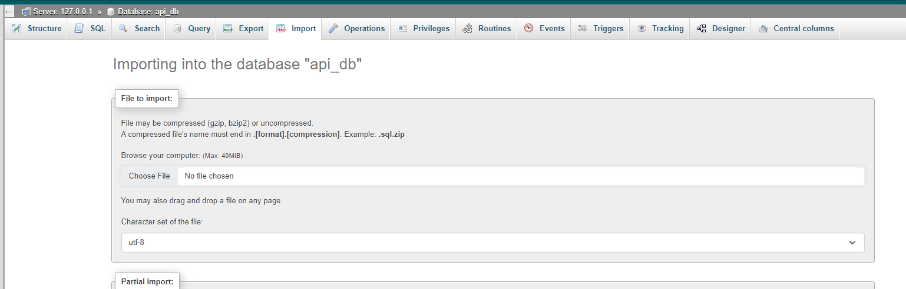

Check if the api_db database has the users table, to do this click on the 
api_db database, and then click on the users table to see the currently 
registered users.

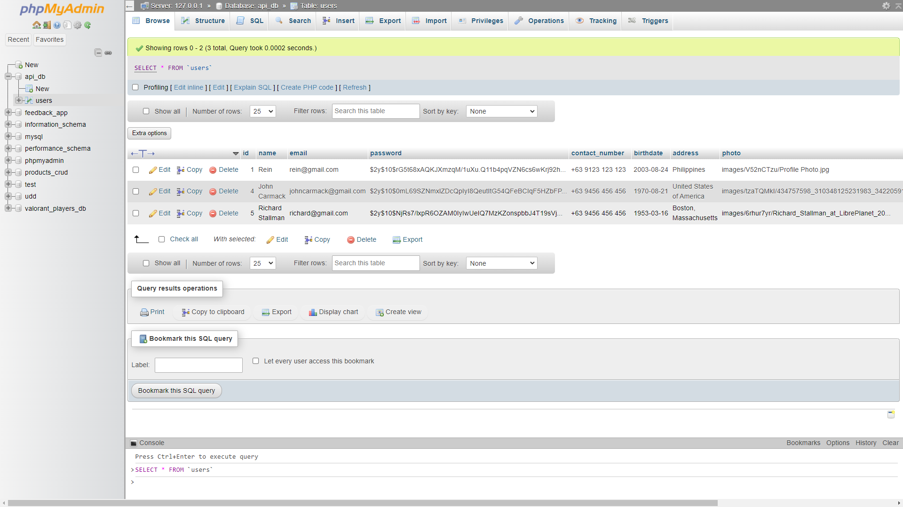

## Using the application

#### Index page

To go to the index page of the application, go to this path:

http://localhost/profile-api/public/users/ 
or 
http://localhost/profile-api/public/users/index.php

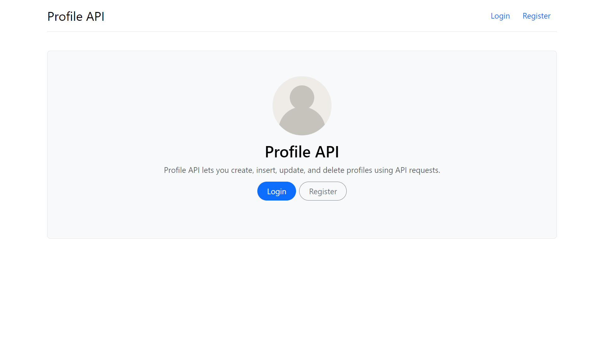

#### Login Page

Click on the Login button at the top or use link:
http://localhost/profile-api/public/users/login_user.php

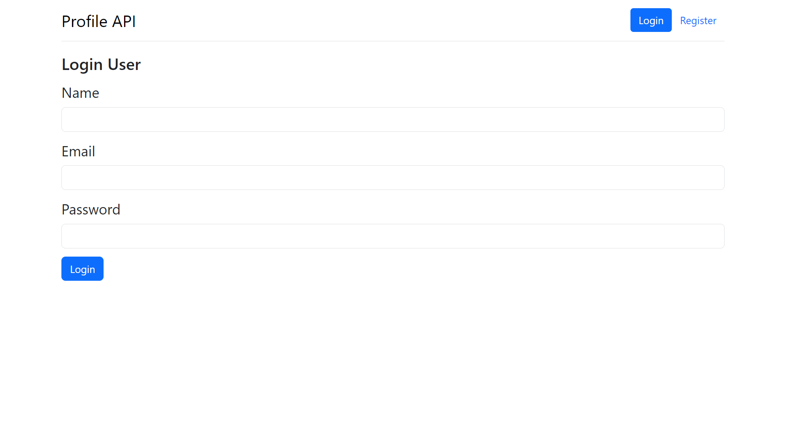

#### Register Page

Click on the Register button at the top or use link:
http://localhost/profile-api/public/users/register_user.php

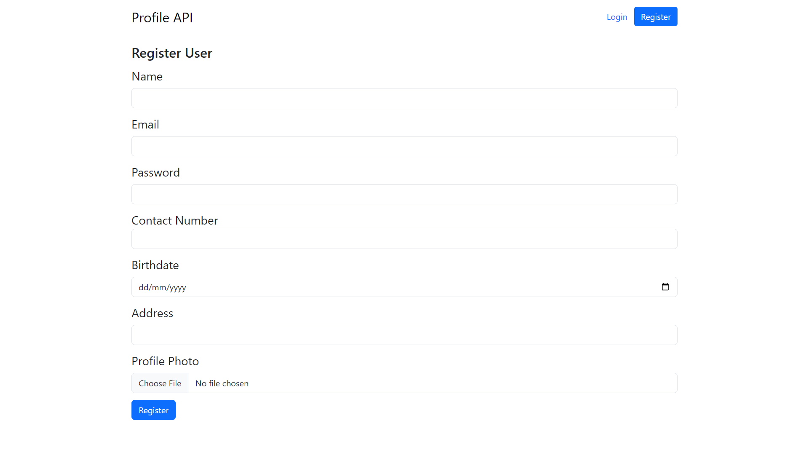

#### Registering a user

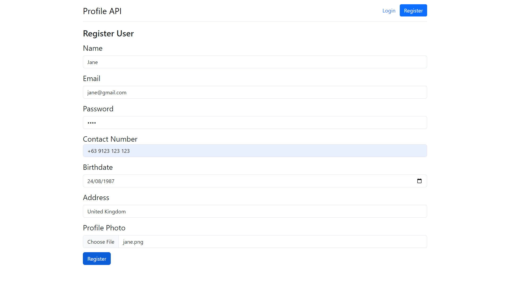

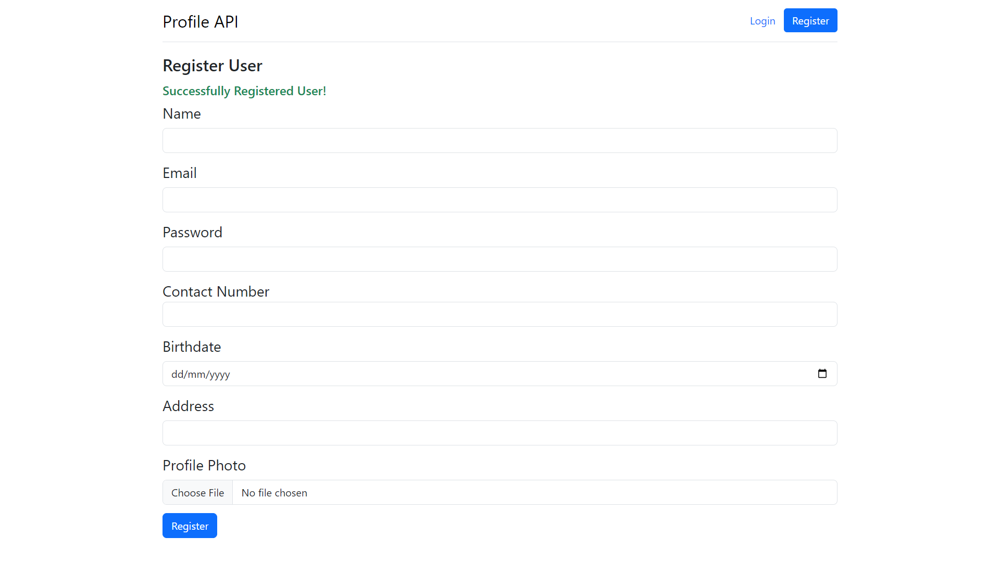

#### Logging in user

Name: Jane
 
Email: jane@gmail.com
 
Password: 1234

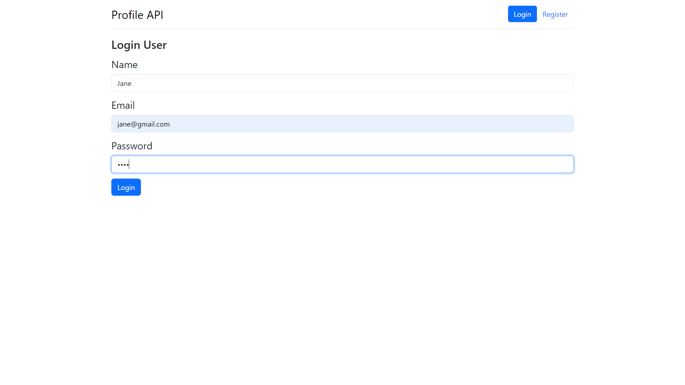

#### Dashboard

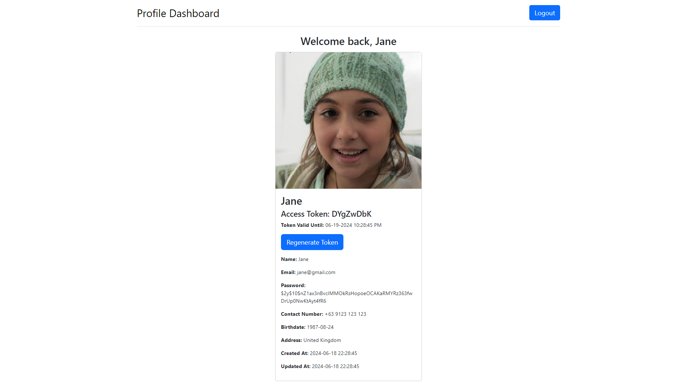

#### Regenerating Token

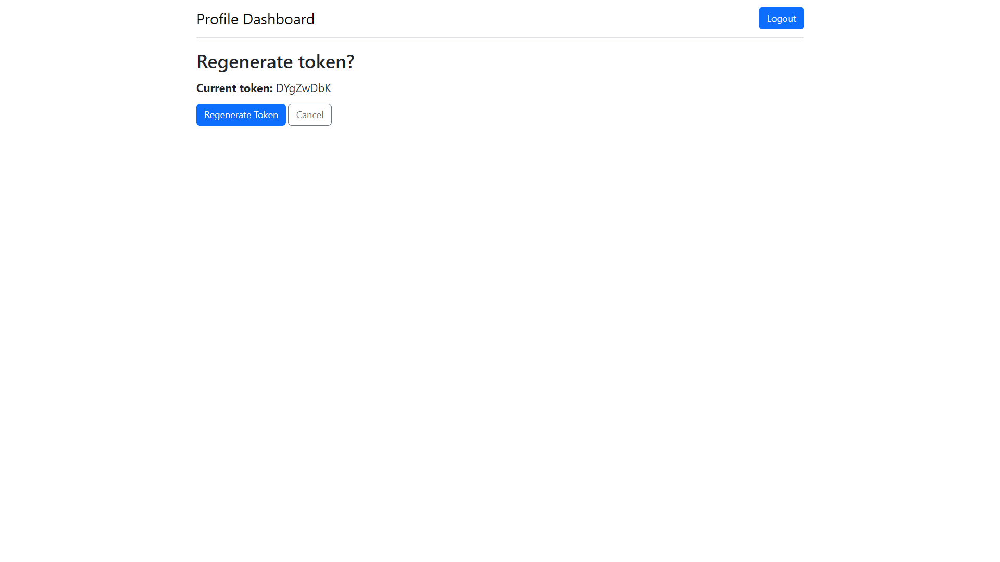

## Usiing GET and POST request endpoints

When using these endpoints, make sure that you are using a valid Bearer Token,
without a valid bearer token, we will not be able to make API requests to our
application. To get a bearer token, register an account and get that account's
generated bearer token. If the bearer token expires, regenerate the bearer 
token in the user dashboard.

When making these requests, check the parameters being used carefully. The 
software being used to make requests is the VSCode Extension of Thunder Client.

## Get request endpoints

#### Default GET request
http://localhost/profile-api/public/api/

#### Get all the users in the database
http://localhost/profile-api/public/api/?what=users

## Post request endpoints

#### Add a user to our database
http://localhost/profile-api/public/api/?what=add-user

#### Edit a user in our database
http://localhost/profile-api/public/api/?what=update-user

#### Delete a user from our database
http://localhost/profile-api/public/api/?what=delete-user

#### Regenerate Bearer token of a user
http://localhost/profile-api/public/api/?what=regenerate-token

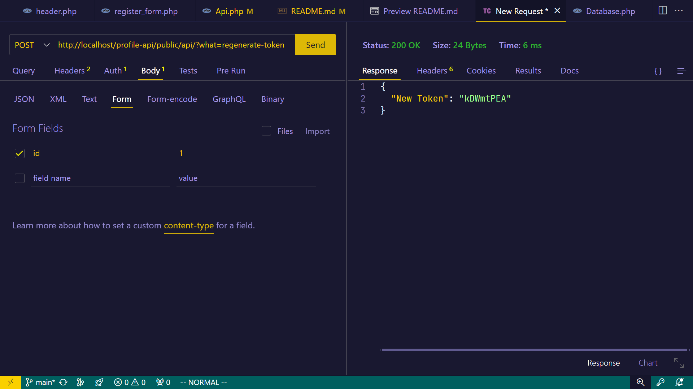